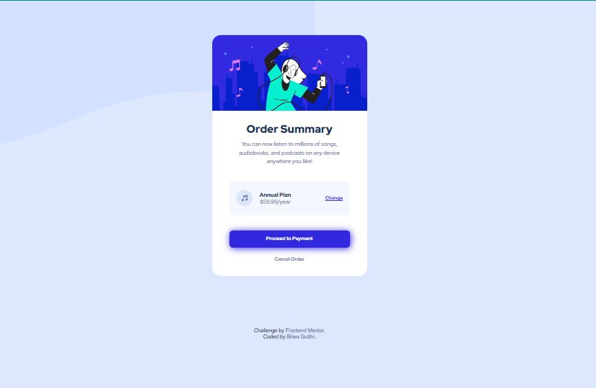

# Frontend Mentor - Order summary card solution

This is a solution to the [Order summary card challenge on Frontend Mentor](https://www.frontendmentor.io/challenges/order-summary-component-QlPmajDUj). Frontend Mentor challenges help you improve your coding skills by building realistic projects. 

## Table of contents

- [Overview](#overview)
  - [The challenge](#the-challenge)
  - [Screenshot](#screenshot)
- [Built with](#built-with)
- [Author](#author)

## Overview

### The challenge

Users should be able to:

- View the optimal layout depending on their device's screen size
- See hover states for interactive elements

### Screenshot

## Built with

- Semantic HTML5 markup
- CSS custom properties

## Author

- LinkedIn - [Bilwa Gutthi]("https://linkedin.com/in/bilwa-gutthi")
- Frontend Mentor - [@bilwagutthi](https://www.frontendmentor.io/profile/bilwagutthi)
- Twitter - [@bilwagutthi](https://www.twitter.com/bilwagutthi)